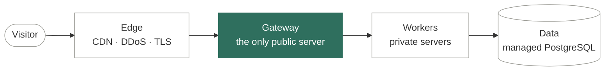

<samp>CORTIE — INDEPENDENT SOFTWARE R&D LAB · SEOUL</samp>

# Build. Run. *Learn.*

cortie is an independent software R&D lab. 
We build our own software, run it in production with real users and real data, 
and write down what we learn.

  <a href="https://cortie.io/"><picture><source media="(prefers-color-scheme: dark)" srcset="https://img.shields.io/badge/cortie.io-ecece6?style=for-the-badge"></picture></a>
  
  
  

<samp>QUESTION · BUILD · RUN · LEARN</samp>

 

<samp>01 / THE IDEA</samp>

## Why we build

**An idea is not tested until it runs.** So we build working systems, put them in front of real use and measure what happens.

cortie is a small, independent lab. There is no brief to satisfy and nothing to sell — the goal is to understand problems well enough to build software that holds up, and to share what we find along the way.

> The interesting part of software starts after it works on one machine — under real load, with real people, over months.

[About the lab ↗](https://cortie.io/studio/)

 

<samp>02 / PROJECTS</samp>

## Built, *and running.*

Software we built to answer real questions — most of it still running on infrastructure we operate.

<table>
<tr>
<td width="50%" valign="top">

<samp>01 / TRAVEL AI</samp> 
**[Stay-Sync](https://cortie.io/work/stay-sync/)**&nbsp; 

Where Gyeonggi North is travelling this month — and the road to get there.

Next.js · TypeScript · Express · Prisma · PostgreSQL · OSRM · OpenAI · Kakao Maps · Docker 
[Case study](https://cortie.io/work/stay-sync/) · [Code](https://github.com/cortie-io/stay_sync) · [Live ↗](https://kbu.stay-sync.cortie.io)

</td>
<td width="50%" valign="top">

<samp>02 / AI TUTOR</samp> 
**[Classnet](https://cortie.io/work/classnet/)**&nbsp; 

An AI tutor that is allowed to be wrong only after a human has checked it.

Next.js · TypeScript · Express · PostgreSQL · Local LLM · Embeddings · Docker 
[Case study](https://cortie.io/work/classnet/) · [Code](https://github.com/cortie-io/classnet) · [Live ↗](https://classnet.chat)

</td>
</tr>
<tr>
<td width="50%" valign="top">

<samp>03 / REAL-TIME DATA</samp> 
**[INU Racing Telemetry](https://cortie.io/work/inu-racing-telemetry/)**&nbsp; 

From a sensor on a moving car to a line on a chart, in real time.

ESP32 · WebSocket · TypeScript · Next.js · PostgreSQL · Docker 
[Case study](https://cortie.io/work/inu-racing-telemetry/) · [Code](https://github.com/cortie-io/inurace_telemetry) · [Live ↗](https://telemetry.cortie.io)

</td>
<td width="50%" valign="top">

<samp>04 / EXPLAINABLE AI</samp> 
**[FlowGuide AI](https://cortie.io/work/flowguide/)**&nbsp; 

An AI tutor that explains why a workflow should be built this way — and then builds one that actually runs.

Next.js · FastAPI · ChromaDB · BM25 + embeddings (RRF) · GPT-4o mini · Chrome extension · n8n · Docker 
[Case study](https://cortie.io/work/flowguide/) · [Code](https://github.com/cortie-io/flowguide)

</td>
</tr>
<tr>
<td width="50%" valign="top">

<samp>05 / ONTOLOGY-GUIDED RAG</samp> 
**[VeriTutor](https://cortie.io/work/veritutor/)**&nbsp; 

Not just the right answer — why it is right, and why the others are wrong.

FastAPI · Next.js · ChromaDB · Ontology engine · LLM-as-a-judge · Python 
[Case study](https://cortie.io/work/veritutor/) · [Code](https://github.com/cortie-io/veriTutor)

</td>
<td width="50%" valign="top">

<samp>06 / INFRASTRUCTURE</samp> 
**[Omni](https://cortie.io/work/omni/)**&nbsp; 

A private server for every student in the class — deployed, checked and repaired by script.

Docker Compose · SSH piping · Flask · MariaDB · Nginx Proxy Manager · Let’s Encrypt · Python 
[Case study](https://cortie.io/work/omni/) · [Code](https://github.com/cortie-io/Omni)

</td>
</tr>
<tr>
<td width="50%" valign="top">

<samp>07 / PERSONALISATION</samp> 
**[Travel Animal 16](https://cortie.io/work/travel-animal-16/)**&nbsp; 

A personality test that is secretly the input form for a recommendation engine.

Next.js · TypeScript · Survey engine · Recommendation inputs 
[Case study](https://cortie.io/work/travel-animal-16/) · [Code](https://github.com/cortie-io/travel-mbti)

</td>
<td width="50%" valign="top">

<samp>08 / EDUCATION</samp> 
**[A+ Finder](https://cortie.io/work/a-plus-finder/)**&nbsp; 

Grades, feedback and a direct line to the professor, in one place.

Flask · MySQL · Tailwind CSS · Password hashing 
[Case study](https://cortie.io/work/a-plus-finder/) · [Code](https://github.com/cortie-io/A-Finder)

</td>
</tr>
</table>

[All projects ↗](https://cortie.io/work/)

 

<samp>03 / RESEARCH</samp>

## Four areas, *one lab.*

Applied AI, product systems, real-time data and infrastructure — studied by building and running real software.

| # | Area | Focus | Related projects |
|:-:|---|---|---|
| 01 | **[Applied AI](https://cortie.io/research/#applied-ai)** | Language-model features measured against real use — retrieval, generation, evaluation and human review. | Classnet · FlowGuide AI · VeriTutor · Stay-Sync |
| 02 | **[Product systems](https://cortie.io/research/#product-systems)** | Web products used by real people — the test bed every other idea has to survive. | Stay-Sync · Classnet · Travel Animal 16 · A+ Finder |
| 03 | **[Real-time & data](https://cortie.io/research/#real-time-and-data)** | Streams, live views and data models that stay correct under load. | INU Racing Telemetry · Stay-Sync · FlowGuide AI |
| 04 | **[Infrastructure & operations](https://cortie.io/research/#infrastructure)** | Self-hosted, secure by default and restored on a schedule — the platform every project runs on. | Omni · Classnet · Stay-Sync · INU Racing Telemetry |

 

<samp>04 / IN PRODUCTION</samp>

## Not demos. *Systems.*

<table>
  <tr>
    <td align="center" valign="top" width="25%"><h3>3</h3>products live on our own infrastructure right now</td>
    <td align="center" valign="top" width="25%"><h3>8</h3>projects across applied AI, product systems, data and infrastructure</td>
    <td align="center" valign="top" width="25%"><h3>1</h3>public entry point — everything else is private</td>
    <td align="center" valign="top" width="25%"><h3>0</h3>cookies and third-party requests on cortie.io</td>
  </tr>
</table>

**Live now** — [kbu.stay-sync.cortie.io ↗](https://kbu.stay-sync.cortie.io) · [classnet.chat ↗](https://classnet.chat) · [telemetry.cortie.io ↗](https://telemetry.cortie.io) (team sign-in)

**The path of a request** — gate-only ingress: one public door, private workers.

<b>Secure by default</b> — defence in depth

 

| Layer | What we do |
|---|---|
| Container | Non-root user, read-only filesystem, all Linux capabilities dropped, no privilege escalation, memory / CPU / process limits, log rotation, health checks. |
| Network | One public entry point. Worker ports are never published on all interfaces — only on loopback and the private network, because Docker’s own rules bypass host firewalls. |
| Transport | HTTPS everywhere with HSTS. Plain HTTP only exists to redirect to HTTPS. |
| Browser | Strict Content Security Policy with no third-party sources, no inline scripts or styles, framing disabled, no referrer leakage, locked-down permissions. |
| Data | Managed database with per-application roles. Secrets live in environment files that are never committed. |
| Change | Back up, test, then reload — and restore automatically if the test fails. Every change is reversible. |

[How we run software ↗](https://cortie.io/infrastructure/)

 

<samp>05 / METHOD</samp>

## Measure, don’t *assume.*

| 01 · Question | 02 · Build | 03 · Run | 04 · Learn |
|---|---|---|---|
| Every project starts from a question worth answering — stated precisely enough to be wrong. | The smallest system that can answer it, held to production standards from the first commit. | Real users, real data, real infrastructure. Behaviour in production is the result that counts. | Measure, write it down, then decide: improve it, keep running it, or retire it. |

<b>Six things we hold to</b>

 

| # | Principle | In practice |
|:-:|---|---|
| 01 | **Working systems over slides** | A hypothesis is tested when it runs — not when it is presented. |
| 02 | **Operations are part of the experiment** | Deployment, monitoring, security and backups belong to the research, not after it. |
| 03 | **Measure; don’t assume** | Logs, numbers and evaluations decide. Estimates are labelled as estimates. |
| 04 | **Simple enough to operate** | Fewer moving parts, and every trade-off written down where the next person will find it. |
| 05 | **People where it matters** | Where a model’s mistake is expensive, a person checks the output before anyone relies on it. |
| 06 | **Write it down, open what we can** | Notes for what we learn, source code for what we can share. |

 

<samp>06 / STACK</samp>

## What it runs on

| Layer | Tools |
|---|---|
| **Languages** |   |
| **Web** |       |
| **AI** |     |
| **Data & real-time** |      |
| **Maps & routing** |   |
| **Operations** |    |

 

<samp>07 / NOTES</samp>

## What we learn, *written down.*

Short write-ups from real projects — the decisions, the dead ends and what we would do again.

| Date | Note | Topic |
|---|---|---|
| Sep&nbsp;28,&nbsp;2026 | **[Gate-only ingress: running production on small servers](https://cortie.io/notes/gate-only-ingress/)** One public door, private workers, and the Docker detail that quietly bypasses your firewall. | Infrastructure |
| Sep&nbsp;28,&nbsp;2026 | **[Routing on real roads](https://cortie.io/notes/routing-on-real-roads/)** Why straight-line distance failed our travel planner, and how a self-hosted routing engine fixed it. | Engineering |
| Aug&nbsp;13,&nbsp;2026 | **[Telemetry without long-lived secrets](https://cortie.io/notes/telemetry-without-long-lived-secrets/)** Streaming a racing car’s sensors to the browser — and keeping keys out of the page. | Real-time |
| Aug&nbsp;05,&nbsp;2026 | **[Nothing ships unreviewed](https://cortie.io/notes/nothing-ships-unreviewed/)** How we generate exam questions with language models without letting a model decide what students study. | AI |

[All notes ↗](https://cortie.io/notes/)

 

<samp>THE CONVERSATION STARTS HERE</samp>

## Questions, *collaboration.*

We are open to research collaboration and to questions about anything we have built or written.

<a href="https://cortie.io/contact/"><picture><source media="(prefers-color-scheme: dark)" srcset="https://img.shields.io/badge/Get_in_touch-ecece6?style=for-the-badge"></picture></a>

 

<samp>© 2026 CORTIE · BUILD. RUN. LEARN. · SEOUL</samp>

